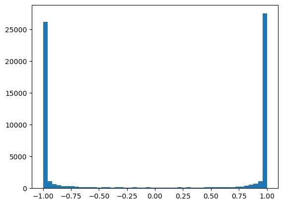
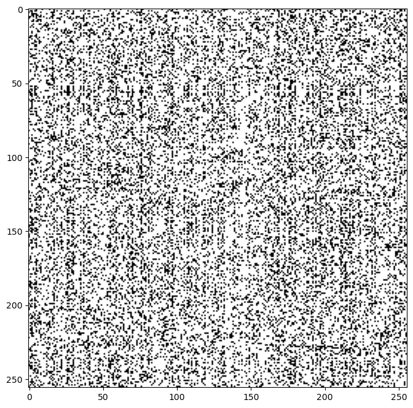

# RNN and Activations!

## INitializing values

- We noticed that at epoch zero, the loss is `26.24` which is very high. That means the initialized weights were terrible.
- The baseline loss should be, at initialization, any character of the 27 is possible so the probability of choosing any character should be `1/27` and if we take log of it and negate it, we see that baseline loss should have been `3.29`

- If the logit outputs are only 4 characters for example and the outs are (0, 0, 0, 0) then that's a uniform distribution with all probs 0.1 and eventually lower base loss. If the logits are (-12, 4, 9, 16) then loss is very high because we are too confident in guessing wrong lol

- So try to keep logits closer to zero

- logits are basically `h @ w2 + b2` so to keep this output low, b2 and w2 have to be very low numbers. We can just put initial bias as zero. And put a very low w2.

- So the logits coming out are now uniformly distributed and initialize loss is 3.29 instead of 26.24

## Saturated Tanh

- If you view the tanh outputs, you'll see a lot of -1.0 and 1.0 as outputs
- You can plot a histogram of all the value counts to verify. Tanh is a squeezing operation and having lot's of negative values means tanh is very actively squeezing inputs to -1.0 and 1.0.
- Visualize the historgram of the input of tanh to see that it has lot's of variance of high and low values

- plt.hist(activation.view(-1).to_list(), 50)

- Remember the grad of tanh is `(1 - t**2) * out_grad`

- So when t = 1.0, the backprop output becomes 0.0 and when t = -1.0, the output is again 0.0

- So basically we are stopping the backpropagataion that is coming from outgrad basically because the tanh is not allowing the gradient to pass and making it 0.0

- And it makes sense, whatever the initial weight is, if I slightly change it the output of tanh will still be 1.0 or -1.0 so it has no influence at all on the loss.

- Example -> w1 value is 2.1 for example which results in input to tanh as 5.0 and that is squeezed to 1.0. If the weight was 5.0001 then also the output from tanh will be 1.0 that means w1.grad is 0.0.

- If the input to tanh is 0.0 then the output is also 0.0 meaning the tanh is very inactive. (Not squeezing) In this case the gradients will just pass right through i.

- The Gradient through the tanh only decreases depending where you lie on the tanh graph

# Dead Neuron

- You can plot the image of [bath_size, tanh_outputs] where values on on the extreme

- plt.imshow(activations.abs() < 0.99, cmap='gray')

- So the rows are input examples and columns are tanh activation values of these neurons. Whites are extreme values and blacks are middle values.

- So now you see so many times tanh activations are on the extreme

- Problem is if you see a neuron that has high value for all the examples you pass to it. That means backprob through this neuron is always zero. And therefore this is a DEAD NEURON.

- The weights got set in sch a way that No training example activated this neuron

