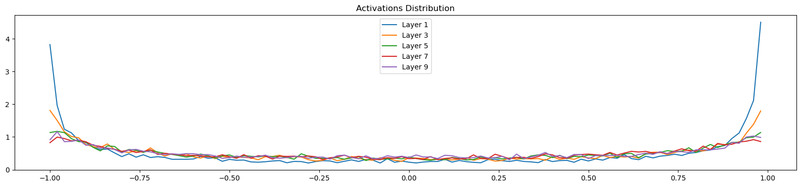
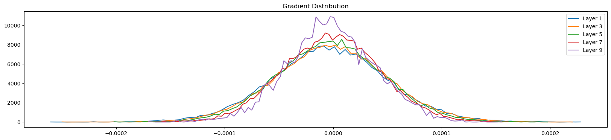

# RNN and Activations!

## INitializing values

- We noticed that at epoch zero, the loss is `26.24` which is very high. That means the initialized weights were terrible.
- The baseline loss should be, at initialization, any character of the 27 is possible so the probability of choosing any character should be `1/27` and if we take log of it and negate it, we see that baseline loss should have been `3.29`

- If the logit outputs are only 4 characters for example and the outs are (0, 0, 0, 0) then that's a uniform distribution with all probs 0.1 and eventually lower base loss. If the logits are (-12, 4, 9, 16) then loss is very high because we are too confident in guessing wrong lol

- So try to keep logits closer to zero

- logits are basically `h @ w2 + b2` so to keep this output low, b2 and w2 have to be very low numbers. We can just put initial bias as zero. And put a very low w2.

- So the logits coming out are now uniformly distributed and initialize loss is 3.29 instead of 26.24

## Saturated Tanh

- If you view the tanh outputs, you'll see a lot of -1.0 and 1.0 as outputs
- You can plot a histogram of all the value counts to verify. Tanh is a squeezing operation and having lot's of negative values means tanh is very actively squeezing inputs to -1.0 and 1.0.
- Visualize the historgram of the input of tanh to see that it has lot's of variance of high and low values

- plt.hist(activation.view(-1).to_list(), 50)

- Remember the grad of tanh is `(1 - t**2) * out_grad`

- So when t = 1.0, the backprop output becomes 0.0 and when t = -1.0, the output is again 0.0

- So basically we are stopping the backpropagataion that is coming from outgrad basically because the tanh is not allowing the gradient to pass and making it 0.0

- And it makes sense, whatever the initial weight is, if I slightly change it the output of tanh will still be 1.0 or -1.0 so it has no influence at all on the loss.

- Example -> w1 value is 2.1 for example which results in input to tanh as 5.0 and that is squeezed to 1.0. If the weight was 5.0001 then also the output from tanh will be 1.0 that means w1.grad is 0.0.

- If the input to tanh is 0.0 then the output is also 0.0 meaning the tanh is very inactive. (Not squeezing) In this case the gradients will just pass right through i.

- The Gradient through the tanh only decreases depending where you lie on the tanh graph

## Dead Neuron

- You can plot the image of [bath_size, tanh_outputs] where values on on the extreme

- plt.imshow(activations.abs() < 0.99, cmap='gray')

- So the rows are input examples and columns are tanh activation values of these neurons. Whites are extreme values and blacks are middle values.

- So now you see so many times tanh activations are on the extreme

- Problem is if you see a neuron that has high value for all the examples you pass to it. That means backprob through this neuron is always zero. And therefore this is a DEAD NEURON.

- The weights got set in sch a way that No training example activated this neuron

- Same happens with Sigmoid, negative part of RELU, 

## Kaiming gain

- The Gain needed to maintain the Normal distribution of the weights with 0 mean and 1 std througout.

- We multiply the weights with this `gain / fan_in**0.2`

- Gain for specfic activations is on the website. Example -> 5/3 for tanh.

## Batch Normalization

- We want the activations that go into the tanh function to not be complete zero then the tanh is inactive and not too large as well because then the tanh is very active. We want a roughly normal distribution with 0 as mean.

- So What batch normalization does is it makes the pre-activations a normal distribution by subtracting the mean and dividing by standard diviation.

- Remember that the mean and standard diviation is of all the values in an input batch. (Across dim = 0 rows)

- Now the values that go into tanh are normally distributed but we still want the model to move and scale this around so we multiply by a gain aplha and add a bias beta.

- These alpha and beta are [1, #activations] shape and act like model parameters.

- So now the gain and bias of batch normalization differ slightly based on what examples came in the batch. So it's a function of the entire batch.So for a different batch, the gradients will be slightly different based on which examples came in that batch.

- This makes batch-normalization act as a regularizer because the outpts differ slights introducing some entropy and generalization.

- After training, the batchNorm gain and bias will be based on last batch trained, so now testing it will create issues of results not being accurate.

- So before testing, we calibrate the batchNorm parameters (mean and std) by forward passing the entire dataset at once to get the overall accurate gain and bias. Doing this is teadeous, So we can just keep a running gain and bias as we train it.

- Example -> While training, `batchnorm__running_mean = 0.999 * batchnorm__running_mean + 0.001 * batchnorm_mean`
Same for Standard Diviation!! We are keeping just adding the new term with 0.001 weight. This is approximate the values in the runtime only.

-  So finally, BatchNorm becomes,

`hpreact = bngain * (hpreact - bnmean) + bnbias`

- Whenever we add a batch norm layer followed by a weight layer, the bias of the weight layer becomes redundant.Because bnbias basically does that work of shifting the prob distribution.

# Layers in Pytorch

- 1) Linear `torch.nn.linear` takes in #inputs and #outputs, optionally, bool bias (default true). We can put this as false if this layer is followed by a batchnorm which has it's own bias. The weights are initialized in a `uniform distribution` and multiplied by `1/#inputs**0.5`

- 2) BatchNorm `torch.nn.batchNorm1d` takes in #features. (Ina linear layer batchnorm size is [1, #hidden]). Then there is a `momentum` term which defines how much of the batch mean and std to add. In our example it was 0.001. High batch size -> 0.1 momentum. Low batch size -> 0.001 momentum.

- 3) Group Normalization and Layer Normalization have become more common in Deep Learning

# Gradients and Activations visualizing

- Visualize the histogram of the gradients and activations of the Tanh. The activations will be to debug gains.
- The tanh is a squeezing function remember, to counter the squeze, you need a correct gain.

- Therefore the gain of (5/3) works perfectly for Tanh layers and a gain of 1.0 works perfectly for just stacks of linear layer.

- `Also visualize the weight gradients and also see the ration of weight.grad : weight.data`. No weight grads should be too big compared to others.

# End of Lecture 4