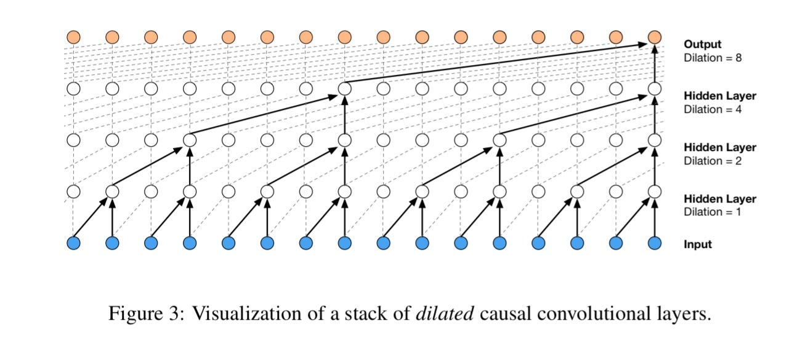

# Building a WaveNet

## Embedding and Flattening classes

- Just stores the embedding matrix and whenever called, indexes from the matrix to give embeddings of the input batch.
- FLatten just concatenate the everything leaving the first dim

## Sequential class

- Manages all the layers and when called, passes the input to all the layers one by one sequencially

## WaveNet

- Primarality used for audio to eventually take in a big block size (#token_size) and to avoid the bottleneack hidden layer that squeeshes all this information too quickly.
- They proposed an alternative of grouping token together and then processing it.

## Shapes and matic multiplication

- Our MLP model takes in data of size [#batch_size, #token_size]
- For example lets consider a batch of 5 examples and token length of 8, so input is of size [5, 8]
- After passing through the embedding matrix of embid_length = 10, the size becomes [5, 8, 10]
- Then we flatten out the last two dim to get [5, 80]
- Finally, we multiple this [5, 80] matrix (x) with a weight matrix of [80, 256] (n_hidden = 256) to get resulting dimension of [5, 256]
- Now Python multiplication is pretty powerful and we can express batches (dim=1) in many dimensions and it will work as long as last value is equal to first value
- For example [5, 4, 20] @ [20, 256] will work fine.

## Approach

- We will have a context length of 8 characters and we will couple 2 characters together.
Example -> Batch size of 5 and context length of 8, embid_size of 10, so input after embeddings becomes -> [5, 8, 10].
- Now we want to feed forward pairs of two characters but in parallel. Therefore, weight matrix will have shape [20, 256] (20 becase two characters passed each with 10 embeddings).
- So basically we have context length of 8 so we will be passing 4 pairs.
- Finally the size at Layer 1 is,
`[5, 4, 20] @ [20, 256] -> [5, 4, 256]`.

- B -> Batch_size (256)
- T -> Context_Length (8)
- C -> Embid_size (10)
- n -> 2
- Which makes [256, 8, 10]

- Now we want that as, [256, 4, 20], so the dimensions should be `[B, T//2, C*n]`.

- And the next Linear layer will take [n * num_embid/num_hidden]

## BatchNorm Bug

- We had designed BathNorm to calculate mean only alone dim = 0 specifically. But now we are passing 3 or 2 dimensions to batchnorms and if we pass 3 dimensions then we need to calculate mean and var across the first 2 dimensions.